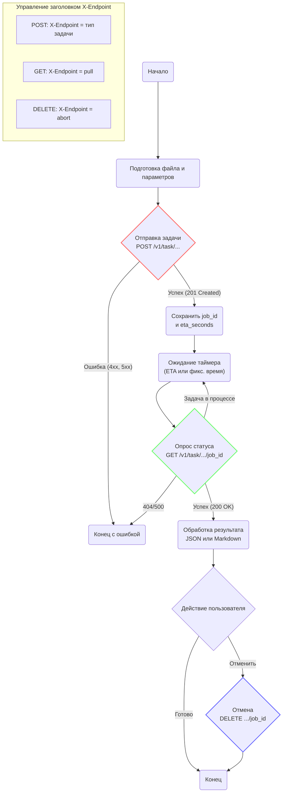

```mermaid
flowchart TD
    Start("Начало") --> PrepareRequest("Подготовка файла и параметров");
    
    PrepareRequest --> PostTask{"Отправка задачи <br> POST /v1/task/..."};
    
    PostTask -- "Ошибка (4xx, 5xx)" --> ErrorEnd("Конец с ошибкой");
    PostTask -- "Успех (201 Created)" --> GetID("Сохранить job_id <br> и eta_seconds");
    
    GetID --> Wait("Ожидание таймера <br> (ETA или фикс. время)");
    Wait --> PollTask{"Опрос статуса <br> GET /v1/task/.../job_id"};
    
    PollTask -- "404/500" --> ErrorEnd;
    PollTask -- "Задача в процессе" --> Wait;
    PollTask -- "Успех (200 OK)" --> Result("Обработка результата <br> JSON или Markdown");
    
    subgraph "Управление заголовком X-Endpoint"
        style PostTask stroke:#f66,stroke-width:2px;
        style PollTask stroke:#6f6,stroke-width:2px;
        style AbortTask stroke:#66f,stroke-width:2px;
        
        Note1["POST: X-Endpoint = тип задачи"];
        Note2["GET: X-Endpoint = pull"];
        Note3["DELETE: X-Endpoint = abort"];
    end

    Result --> UserAction{"Действие пользователя"};
    UserAction -- "Отменить" --> AbortTask{"Отмена <br> DELETE .../job_id"};
    UserAction -- "Готово" --> Finish("Конец");
    AbortTask --> Finish;
```
