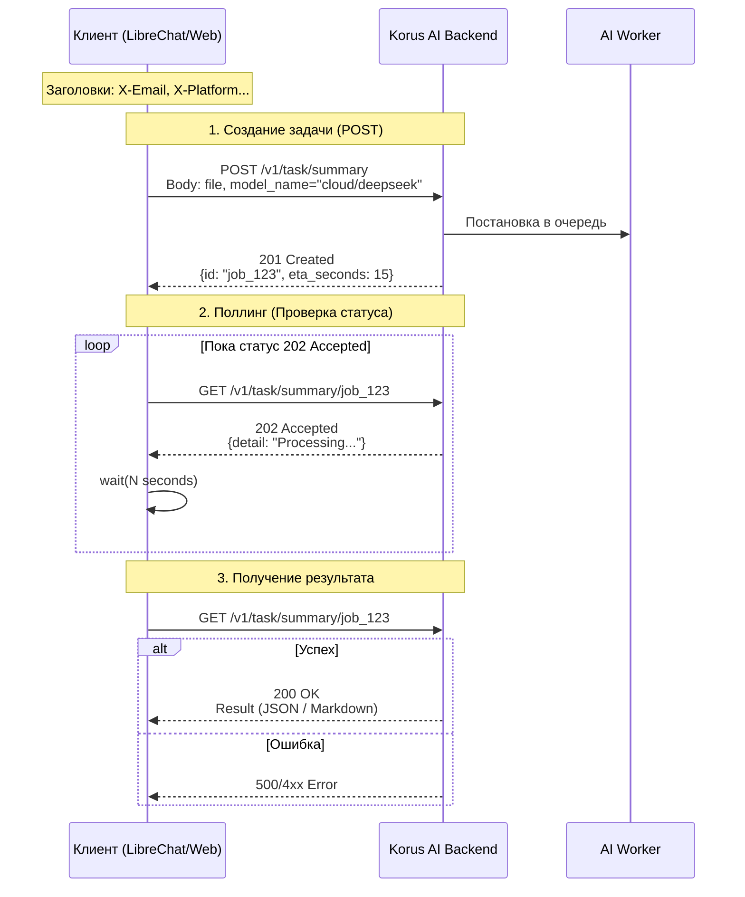

# Руководство по интеграции с Korus AI API (v1.1.0)

Этот документ описывает обновленный механизм взаимодействия с бэкендом Korus AI. API работает в асинхронном режиме.

## 1. Обязательные заголовки

Все запросы к API (POST, GET, DELETE) должны содержать следующий набор заголовков.
**Важно:** Заголовок `X-Endpoint` упразднен, параметр `client` удален из тела запроса.

| Заголовок | Значение | Описание |
|---|---|---|
| `X-Platform-Name` | `libre_chat` | Название платформы |
| `X-Platform-Type` | `web` | Тип клиента |
| `X-Email` | `user@example.com` | Email текущего пользователя |
| `Accept` | `application/json` | Ожидаемый формат ответа |

## 2. Схема работы



## 3. Пошаговый алгоритм

### Шаг 1: Инициация задачи (POST)

Отправка файла и параметров обработки.

*   **URL:** `/v1/task/{task_type}` (например, `/v1/task/summary`)
*   **Метод:** `POST`
*   **Content-Type:** `multipart/form-data`

**Параметры тела запроса:**

*   `file`: Бинарные данные файла.
*   `model_name`: Строка формата `provider/model`.
    *   Примеры: `local/t-pro-it-1`, `cloud/gpt-4o`, `cloud/deepseek`.
*   `response_type`: Обычно `txt`.
*   Дополнительные поля зависят от типа задачи (`diarize` для транскрибации, `template_name` для саммари).

**Пример ответа (Успех):**
```json
HTTP/1.1 201 Created
{
  "id": "550e8400-e29b-41d4-a716-446655440000",
  "eta_seconds": 30
}
```

---

### Шаг 2: Получение результата (Polling)

Периодический опрос сервера по полученному `id`.

*   **URL:** `/v1/task/{task_type}/{job_id}`
*   **Метод:** `GET`

**Логика обработки статусов:**

1.  **Статус 202 (Accepted):**
    *   Задача еще выполняется.
    *   Тело ответа: `{"detail": "Processing..."}`.
    *   **Действие:** Подождать (sleep) 2–5 секунд и повторить запрос.
2.  **Статус 200 (OK):**
    *   Задача завершена.
    *   Тело ответа содержит результат (структура зависит от задачи).
    *   **Действие:** Обработать результат, остановить цикл опроса.
3.  **Статус 4xx/5xx:**
    *   Ошибка (файл не найден, сбой сервера).
    *   **Действие:** Прервать цикл, показать ошибку.

---

## 4. Пример кода (Python)

```python
import time
import requests

BASE_URL = "http://158.160.34.122:8085/backend"
# Общие заголовки для всех запросов
HEADERS = {
    "X-Platform-Name": "libre_chat",
    "X-Platform-Type": "web",
    "X-Email": "user@example.com",
    "Accept": "application/json"
}

def create_summary_task(file_path):
    # 1. Отправка файла
    with open(file_path, 'rb') as f:
        files = {'file': f}
        data = {
            'model_name': 'cloud/deepseek',  # Новый формат имени модели
            'response_type': 'txt',
            'template_name': 'default30'
        }
        res = requests.post(f"{BASE_URL}/v1/task/summary", headers=HEADERS, files=files, data=data)
    
    if res.status_code == 201:
        return res.json()['id']
    else:
        raise Exception(f"Failed to create task: {res.text}")

def wait_for_result(task_id):
    # 2. Поллинг (Цикл ожидания)
    url = f"{BASE_URL}/v1/task/summary/{task_id}"
    
    while True:
        res = requests.get(url, headers=HEADERS)
        
        if res.status_code == 200:
            print("Задача выполнена!")
            return res.json()  # Возвращаем результат
            
        elif res.status_code == 202:
            print("Задача в обработке, ожидание...")
            time.sleep(3)  # Пауза 3 секунды
            
        else:
            raise Exception(f"Ошибка при поллинге: {res.status_code}")

# Использование
try:
    job_id = create_summary_task("meeting.docx")
    result = wait_for_result(job_id)
    print(result)
except Exception as e:
    print(e)
```
