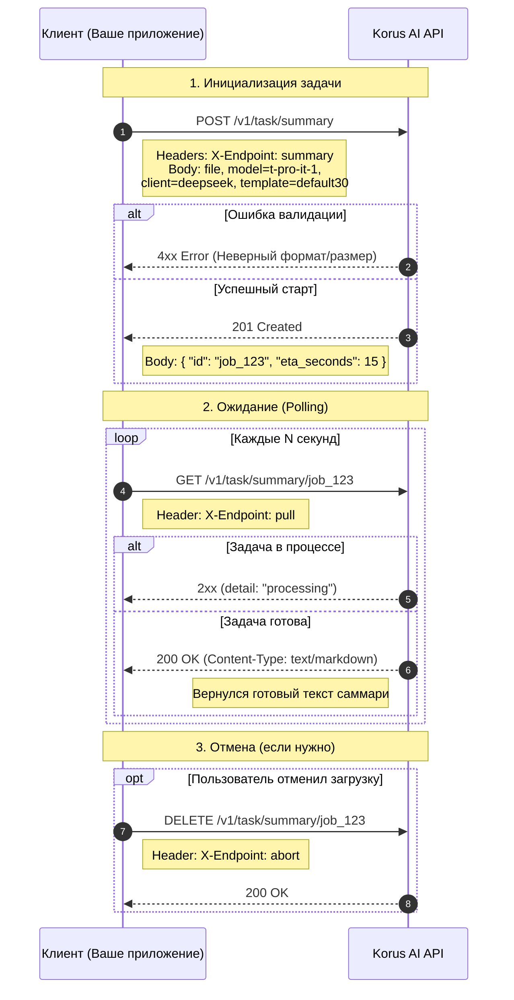

```mermaid
sequenceDiagram
    autonumber
    participant Client as Клиент (Ваше приложение)
    participant API as Korus AI API
    
    Note over Client, API: 1. Инициализация задачи
    Client->>API: POST /v1/task/summary
    Note right of Client: Headers: X-Endpoint: summary<br/>Body: file, model=t-pro-it-1,<br/>client=deepseek, template=default30
    
    alt Ошибка валидации
        API-->>Client: 4xx Error (Неверный формат/размер)
    else Успешный старт
        API-->>Client: 201 Created
        Note left of API: Body: { "id": "job_123", "eta_seconds": 15 }
    end

    Note over Client, API: 2. Ожидание (Polling)
    loop Каждые N секунд
        Client->>API: GET /v1/task/summary/job_123
        Note right of Client: Header: X-Endpoint: pull
        
        alt Задача в процессе
            API-->>Client: 2xx (detail: "processing")
        else Задача готова
            API-->>Client: 200 OK (Content-Type: text/markdown)
            Note left of API: Вернулся готовый текст саммари
        end
    end

    Note over Client, API: 3. Отмена (если нужно)
    opt Пользователь отменил загрузку
        Client->>API: DELETE /v1/task/summary/job_123
        Note right of Client: Header: X-Endpoint: abort
        API-->>Client: 200 OK
    end
```