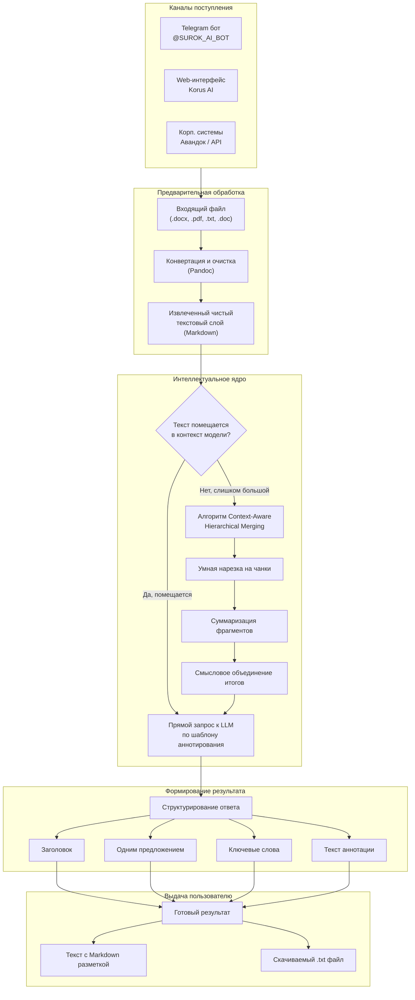

# Высокоуровневая схема работы сервиса "Аннотирование документов"

Этот документ описывает бизнес-логику ИИ-сервиса суммаризации, его ключевые этапы обработки и отличия от прямого взаимодействия с LLM.

## 1. Блок-схема бизнес-процесса

---

## 2. Описание процесса и ключевые отличия от простого запроса к LLM

Данный сервис решает проблему обработки корпоративных документов, превращая неструктурированные файлы в четкие аналитические справки.

### Ключевые преимущества

#### 1. «Всеядность» форматов (Format Agnostic)
-   **Как обычно:** Чтобы передать документ в LLM, пользователю нужно вручную открывать Word/PDF, копировать текст, бороться с кривым форматированием, таблицами и разрывами страниц.
-   **В сервисе:** Пользователь просто загружает файл (`.docx`, `.pdf` и др.). Движок (Pandoc) автоматически извлекает полезное содержимое, игнорируя «мусор» (колонтитулы, служебную разметку).

#### 2. Преодоление ограничений по объему (Infinite Context)
-   **Как обычно:** При попытке обработать большой документ (например, годовой отчет или юридический договор) обычная LLM выдаст ошибку: `Token limit exceeded`.
-   **В сервисе:** Реализован алгоритм **Context-Aware Hierarchical Merging**.
    -   Если документ не помещается в контекстное окно модели, сервис интеллектуально "нарезает" его на логические части.
    -   Суммаризирует каждую часть отдельно, сохраняя ключевую информацию.
    -   Собирает из полученных фрагментов итоговое, целостное резюме.
    -   *Для пользователя это происходит прозрачно: он просто получает результат, не задумываясь о технических лимитах.*

#### 3. Гарантированная структура результата (Structured Output)
-   **Как обычно:** Прямой запрос к LLM («Сделай саммари») дает непредсказуемый результат. В одном случае это будет 3 абзаца, в другом — маркированный список, в третьем — вольный пересказ.
-   **В сервисе:** Используется строгий шаблон для выходных данных. Бизнес-пользователь всегда получает стандартизированную карточку документа:
    1.  **`title`:** Понятный заголовок.
    2.  **`one_sentence`:** Суть документа за 5 секунд чтения.
    3.  **`key_words`:** Теги для быстрого поиска и классификации.
    4.  **`annotation`:** Детальное саммари заданного объема.

#### 4. Бесшовная интеграция (Omnichannel)
Сервис — это не просто отдельный «чат». Это интеллектуальный модуль, который встраивается в рабочие инструменты сотрудника:
-   **Мессенджер (Telegram):** для быстрой обработки документов «на лету».
-   **Корпоративные системы (Авандок через API):** для автоматического аннотирования и заполнения карточек документов при их регистрации в СЭД.
