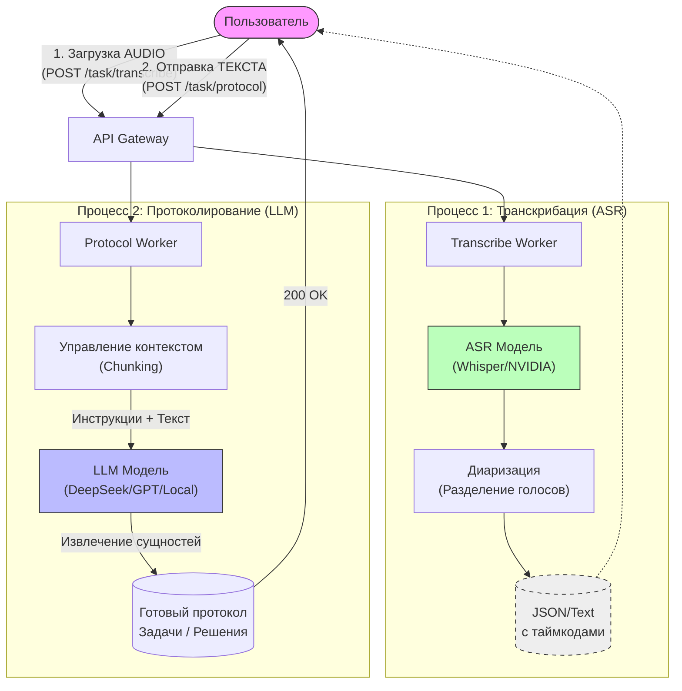

# Схема работы сервисов Транскрибации и Протоколирования

```mermaid
graph TD
    User([Пользователь])
    APIGW[API Gateway]
    
    subgraph "Процесс 1: Транскрибация (ASR)"
        TranscribeWorker[Transcribe Worker]
        Whisper["ASR Модель<br/>(Whisper/NVIDIA)"]
        Diarization["Диаризация<br/>(Разделение голосов)"]
        ResultText[("JSON/Text<br/>с таймкодами")]
    end

    subgraph "Процесс 2: Протоколирование (LLM)"
        ProtocolWorker[Protocol Worker]
        ContextWindow["Управление контекстом<br/>(Chunking)"]
        LLM["LLM Модель<br/>(DeepSeek/GPT/Local)"]
        ResultProtocol[("Готовый протокол<br/>Задачи / Решения")]
    end

    %% Flow 1: Transcribe
    User -- "1. Загрузка AUDIO<br/>(POST /task/transcribe)" --> APIGW
    APIGW --> TranscribeWorker
    TranscribeWorker --> Whisper --> Diarization
    Diarization --> ResultText
    ResultText -.-> User
    
    %% Flow 2: Protocol
    User -- "2. Отправка ТЕКСТА<br/>(POST /task/protocol)" --> APIGW
    APIGW --> ProtocolWorker
    ProtocolWorker --> ContextWindow
    ContextWindow -- "Инструкции + Текст" --> LLM
    LLM -- "Извлечение сущностей" --> ResultProtocol
    ResultProtocol -- "200 OK" --> User

    style User fill:#f9f,stroke:#333
    style Whisper fill:#bfb,stroke:#333
    style LLM fill:#bbf,stroke:#333
    style ResultText fill:#eee,stroke:#333,stroke-dasharray: 5 5
```
