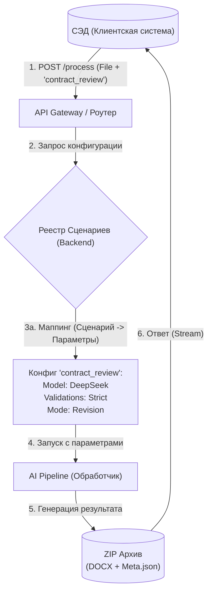

# Архитектурное предложение: Универсальный интеграционный протокол

## 1. Концепция решения

Для обеспечения стабильности интеграции с СЭД при частых изменениях на стороне AI-сервиса (смена моделей, удаление параметров типа `client`, изменение формата правил), предлагается перейти от **императивного** подхода (передача конкретных настроек) к **декларативному** (передача бизнес-сценария).

### Схема взаимодействия



---

## 2. Вечный контракт API (API Contract)

Этот интерфейс фиксируется один раз. Любые изменения внутренней логики (какие заголовки требует бэкенд, как называются модели `t-pro-it-1` или `gpt-4`) решаются на стороне сервиса, а не клиента.

### 2.1 HTTP Запрос

**Endpoint:** `POST /api/v2/integration/document-task`  
*(Единая точка входа, скрывающая за собой сервисы `/doc-control`, `/summary` и другие, либо специфичный роут, но с унифицированным Body)*

#### Headers (Заголовки идентификации)
Формируются клиентом автоматически и неизменно:
*   `Content-Type`: `multipart/form-data`
*   `X-Platform-ID`: `cis_edms_core` (Статический ID системы-клиента)
*   `X-Trace-ID`: `{UUID}` (Сквозной ID для логирования)
*   `X-User-Context`: `{ "email": "user@corp.com", "role": "editor" }` (JSON в Base64 или просто email, если безопасности достаточно)

> **Важно:** Клиент НЕ передает заголовки, специфичные для внутренней кухни, такие как `X-Endpoint`, который планируется к удалению, или `X-Platform-Name`, если он нужен только для внутренней статистики — сервис сам обогатит запрос этими данными на основе `X-Platform-ID`.

#### Body (Параметры)
Минималистичный набор полей:

| Поле | Тип | Обязательность | Описание |
|:---|:---|:---|:---|
| `file` | Binary | **Да** | Исходный файл (DOCX). |
| `scenario_key` | String | **Да** | **Ключевой параметр.** Идентификатор бизнес-задачи. <br>Примеры: `full_audit`, `spelling_fast`, `format_fix`. |
| `callback_url` | String | Нет | URL для вебхука (если процесс долгий и нужен асинхронный ответ). |
| `options_override` | JSON | Нет | Поле для исключительных ситуаций. Позволяет переопределить конкретные настройки сценария, если это разрешено политикой. |

---

## 3. Логика маппинга (Слой абстракции)

На стороне сервиса создается конфигурация (Registry), которая преобразует `scenario_key` в технические параметры, описанные в вашей документации (`PIPELINE.md` и др.).

**Пример конфигурации на бэкенде:**

Если СЭД присылает `scenario_key` = **"legal_audit"**:

1.  **Backend смотрит в конфиг:**
    ```json
    "legal_audit": {
      "internal_endpoint": "/doc-control",
      "model_selector": "cloud/deepseek",     // Клиент не знает про deepseek
      "mode": "revision",                     // Режим правок
      "rules": {                              // Полный набор правил
         "rule_syntax_and_spelling": {},
         "normalize_quotation_marks": {"quote_style": "guillemets_ru"},
         "enable_llm_validator": true
      }
    }
    ```
2.  **Backend формирует запрос к `doc-control`:**
    Автоматически подставляет нужные `X-Platform-Name`, удаляет `client` (так как он deprecated), преобразует имя модели.

**Выгода:** Когда выйдет новая модель `vllm-new-2.0` или изменится формат `rules`, вы меняете JSON на сервере. **СЭД не обновляется.**

---

## 4. Обработка ответа (Универсальный ZIP)

Клиент реализует логику "слепого" приема результата, которая не сломается при добавлении новых типов отчетов.

**Алгоритм для СЭД:**
1. Получить `200 OK` с `Content-Type: application/zip`.
2. Сохранить поток как временный файл.
3. Распаковать архив.
4. **Итерация по файлам:**
    *   Если `*.docx` -> Создать новую версию документа в карточке (Основной результат).
    *   Если `meta.json` -> Распарсить поле `summary` или `errors` и показать в интерфейсе пользователю.
    *   *(На будущее)* Если `*.pdf` -> Приложить как "Лист сравнения".
    *   *(На будущее)* Если `*.mp3` -> Приложить как аудио-комментарий.
5.  Если произошла ошибка `400/500` -> Показать текст из тела ответа.

---

## 5. Резюме изменений относительно текущей документации

| Было (Current) | Станет (Proposed) | Преимущество |
|:---|:---|:---|
| Параметр `client` (deprecated) | Отсутствует | Нет зависимости от версий библиотек AI |
| Параметр `model_name` | Спрятан в `scenario_key` | Можно менять модели без релиза СЭД |
| JSON `rules` передается клиентом | Хранится на сервере в профиле | Сложные правила настраиваются дата-сайентистами, а не интеграторами |
| Header `X-Endpoint` | Управляется роутером | Меньше технического долга у клиента |

Этот подход полностью удовлетворяет требованию "максимальной независимости" для клиента Enterprise-уровня.
